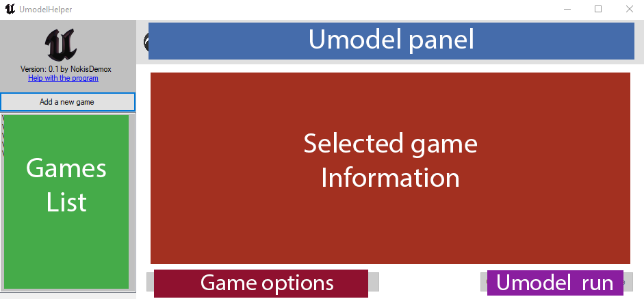
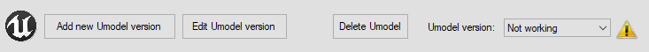

# UmodelHelper
UmodelHelper is a GUI manager for <a href="https://github.com/gildor2/UEViewer">UE Viewer</a> (also known as *umodel*) versions and <a href="https://www.unrealengine.com/en-US">Unreal Engine</a> games. Its made to manage game data like paths and AES keys (used in some UE games to encript the assets files) as well as umodel versions to easily extract or view game data. 
## Why use UmodelHelper
Feels a bit tedious to use umodel as it requires you to input the game path, version and aes keys every time you open it, can be solved using .bat or .sh files to automate it. Depending on the game you are trying to use umodel, some versions of umodel may crash and you need to change to a newer or older, or even custom compiled version of the program.
UmodelHelper is made to manage your Unreal Engine games as well as your umodel installed versions.
Once you add a game to UmodelHelper its saved locally and can be open with any version of umodel you need, making it easier to manage your game and umodel versions.
## OS Support
Right now windows is the only OS supported, possibly will be adapted to also work on linux.

## How to use UmodelHelper (Basic options)
### Program distribution
This tool is divided in a list of your games, the umodel panels and the main view of the selected game. In this image is displayed the distribution of the program:
 

 
In terms of games is possible to add, duplicate, modify and delete them, so its easy to manage them, same goes with umodel versions.
### Adding games and umodel
To add them just click on the button and complete the text boxes, in case anything need is empty or bad written, it will be automaticly replace to avoid errors. In case anything was written incorrectly can be change by editing the game, or replacing the umodel version.

After adding a game and umodel version you can open the umodel or run it to directly open it with the selected game. To make everything more intuitive, in the umodel top section after selecting a saved one an icon will appear, if its a warning it means that the file is not correct (not a valid path for an .exe), while if the path is correct the icon will be an information icon and in case of being clicked it will displayed the umodel version information (it will run *umodel.exe -version*).
 

 

With games we have the same icon information, a warning means there is no .exe on the selected path, and having the game icon will mean the game is detected correctly.
 

 
### Run umodel 
If the paths for the umodel and game are correct, the only thing left is to make sure the game has the correct information on the data marked with a * as is the info that will go to umodel.

## Other useful features in UmodelHelper

### Custom arguments for umodel
On UmodelHelper you can add any arguments you usually use in umodel, as well as showing all the available arguments for the selected version (*umodel.exe -help*).
**For example:** if you like to always export the images as png, the argumnent *-png* is the one you should use so adding it to your custom arguments field will run UE viewer with said setting.

### Automatic AES KEY conversion
Once the game is added the AES key will show as HEX (for UE viewer) and in Base 64, used in other tools like *UnrealPak*.

## License
UmodelHelper is licensed under Apache 2.0 License.
